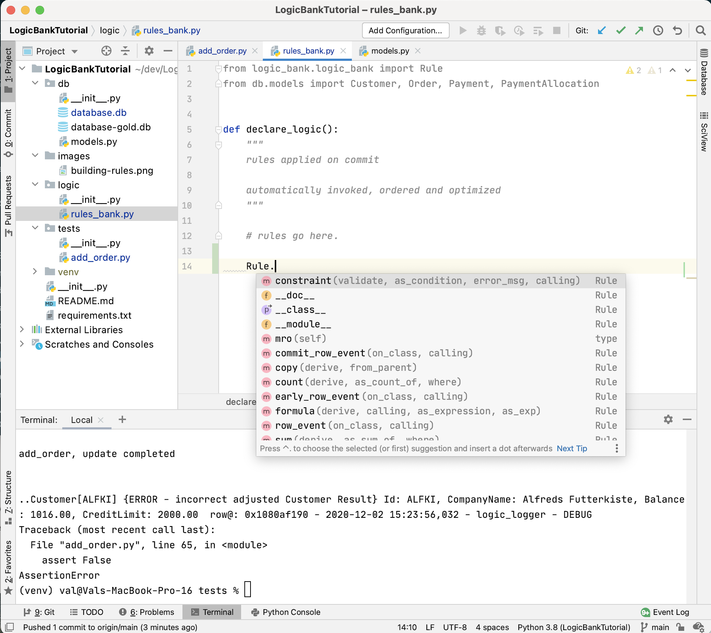

Logic Bank Tutorial
===================

This project explores the shortest possible example of multi-table
logic, to illustrate the use of [LogicBank](https://github.com/valhuber/LogicBank):

* Add an Order to a Customer
* Rules declared to
   * Adjust the Customer Balance, and
   * Verify the Balance <= 2000


Background
----------
Use Logic Bank to govern SQLAlchemy
update transaction logic - multi-table derivations, constraints,
and actions such as sending mail or messages. Logic consists of _both:_

* **Rules - 40X** more concise
using a spreadsheet-like paradigm, and

* **Python - control and extensibility,**
using standard tools and techniques

Logic Bank is based on SQLAlchemy - it handles `before_flush` events
to enforce your logic.

Getting started
---------------

First you'll need to get the source of the project. Do this by cloning the
whole Graphene-SQLAlchemy repository:

```bash
# Get the example project code
git clone https://github.com/valhuber/LogicBankTutorial.git
```

It is good idea (but not required) to create a virtual environment
for this project. We'll do this using
[virtualenv](http://docs.python-guide.org/en/latest/dev/virtualenvs/)
to keep things simple,
but you may also find something like
[virtualenvwrapper](https://virtualenvwrapper.readthedocs.org/en/latest/)
to be useful:

```bash
# Create a virtualenv in which we can install the dependencies
cd LogicBankTutorial
virtualenv venv
source venv/bin/activate
```

Now we can install our dependencies:

```bash
pip install -r requirements.txt
```

Verify Installation
-------------------
Verify that the following runs, but fails:
```bash
cd LogicBankTutorial/tests
python add_order.py
```

It failed our assert that the balance increased, because there are no rules.

Adding Rules
------------

Let's fix that: add the following to ```logic/rules_bank.py```:

```python

    Rule.constraint(validate=Customer,
                    error_msg="balance ({row.Balance}) exceeds 2000)",
                    as_condition=lambda row: row.Balance <= 2000)

    Rule.sum(derive=Customer.Balance, as_sum_of=Order.AmountTotal)

```
You can paste these rules, or build them with an IDE such as PyCharm using code
completion:

<figure></figure>


Declaring Rules
---------------
The ```logic/__init__``` file contains the code
that opens the database and registers the rules,
near the end:

```python

conn_string = "sqlite:///" + db_loc
engine = sqlalchemy.create_engine(conn_string, echo=False)  # sqlalchemy sqls...

session_maker = sqlalchemy.orm.sessionmaker()
session_maker.configure(bind=engine)
session = session_maker()

rule_list = None
db = None
LogicBank.activate(session=session, activator=declare_logic)

print("\n" + prt("END - connected, session created, listeners registered\n"))
```

Note rules are based on your data model.  **Important considerations apply,**
as described in the [Logic Bank Wiki](https://github.com/valhuber/LogicBank/wiki/Managing-Rules).

Rule Execution - Sum
--------------------
You don't invoke the rules directly; the Logic Base
Rule Engine handles `before_flush` events
to

* **watch** for changes to referenced attributes
* **react** by running the referencing rules
* changes can **chain** to other rules.

You can re-run the test, which should now succeed.

> Here, the insertion of an Order with ```AmountOwed``` triggers the
> ```Customer.Balance``` rule.

Note the log, which shows all the rules that fire:

<figure></figure>

Rule Execution - Constraint
---------------------------

Find this line, and change the 500 to 1000:

```python
amount_total = 500  # 500 should work; change to 1000 to see constraint fire
```

Re-run the test; should now fail with a constraint exception.


Rule Reuse
----------

Note rules are not tied to a specific verb, but rather to the data.  So,
our ```sum``` rule will also ***react*** if you delete an order, or
update an order with the ```AmountOwed``` changed.


Rule Chaining
-------------

This completes our simple example.  You will typically have more rules that
fire on a transaction.  You can explore a more typical set of rules in
the Logic Bank examples.


Extensibility
-------------

In this example, our logic was strictly spreadsheet-like rules.  You will
typically need to extend rules with Python code, as illustrated in the
Logic Bank examples.

Just as with regular Python, you can set breakpoints, perform logging, etc.